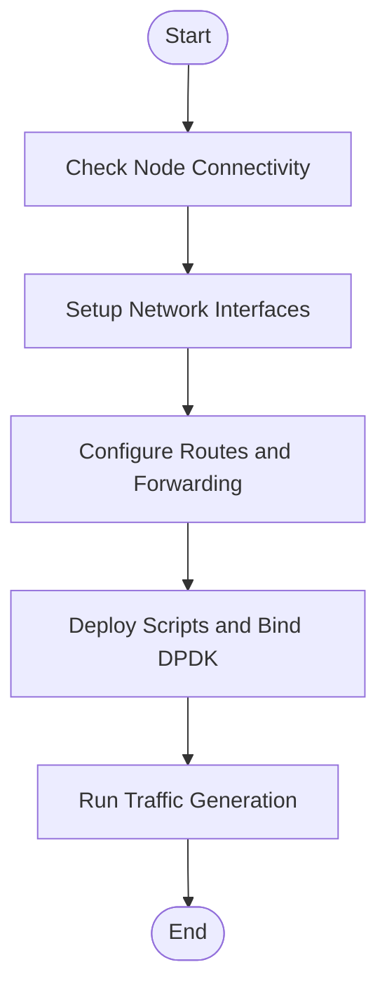
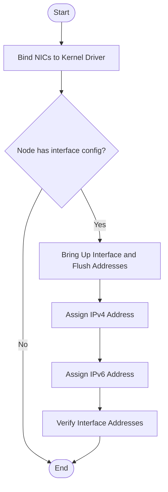
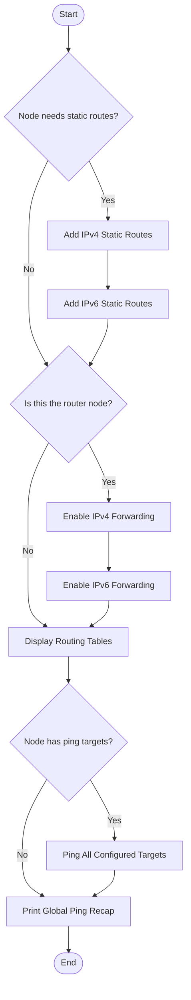
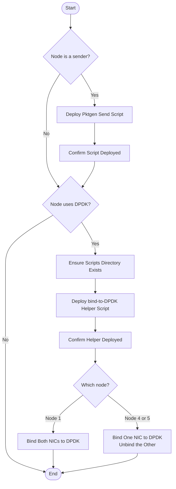
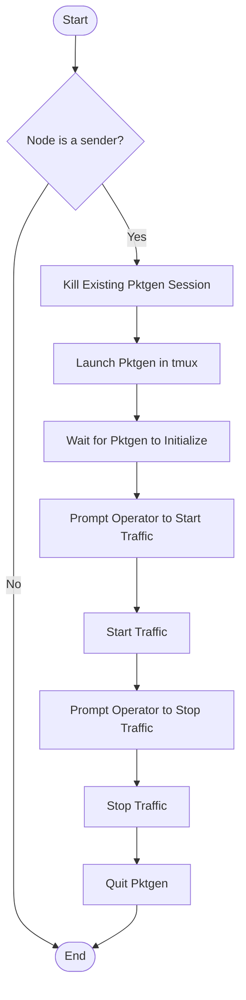

# Ansible Pipeline Flowcharts

This document describes the automation pipeline for provisioning a multi-node DPDK/pktgen test environment. The pipeline is executed sequentially across 5 playbooks.

---

## 1. General System Overview

High-level view of the full pipeline by phase (not by filename).

---

## 2. `01_basic_setup.yaml` — Network Interface Setup

Binds NICs to the kernel driver, configures each interface, then assigns IPv4 and IPv6 addresses.

**Node-to-interface mapping:**

| Node | Interface | IPv4 | IPv6 |
|---|---|---|---|
| 10.90.1.1 | enp1s0f0np0 | 192.168.46.1/24 | fd00:46::1/64 |
| 10.90.1.1 | enp1s0f1np1 | 192.168.56.1/24 | fd00:56::1/64 |
| 10.90.1.4 | enp1s0f1np1 | 192.168.46.4/24 | fd00:46::4/64 |
| 10.90.1.5 | enp1s0f1np1 | 192.168.56.5/24 | fd00:56::5/64 |
| 10.90.1.6 | enp1s0f0np0 | 192.168.56.6/24 | fd00:56::6/64 |
| 10.90.1.6 | enp1s0f1np1 | 192.168.46.6/24 | fd00:46::6/64 |

---

## 3. `02_setup_route.yaml` — Routing and Forwarding

Adds static routes on sender nodes, enables IP forwarding on the router node, then validates connectivity with ping tests.

**Static routes added:**

| Node | Direction | Destination | Via |
|---|---|---|---|
| 10.90.1.4 | IPv4 | 192.168.56.0/24 | 192.168.46.6 (Node6) |
| 10.90.1.4 | IPv6 | fd00:56::/64 | fd00:46::6 (Node6) |
| 10.90.1.5 | IPv4 | 192.168.46.0/24 | 192.168.56.6 (Node6) |
| 10.90.1.5 | IPv6 | fd00:46::/64 | fd00:56::6 (Node6) |

---

## 4. `03_setup_scripts.yaml` — Script and DPDK Deployment

Deploys pktgen send scripts to sender nodes, deploys the DPDK bind helper to nodes 1/4/5, then binds each node's NIC(s) to the DPDK driver.

---

## 5. `04_start_pktgen.yaml` — Traffic Generation

Launches pktgen inside a detached tmux session on sender nodes, then interactively prompts the operator to start and stop UDP traffic.

**Pktgen configuration per sender node:**

| Node | Packet File | CPU Core Mapping |
|---|---|---|
| 10.90.1.1 | /home/ansible/node1_send.pkt | `-m [1-3:4-6].0 -m [7-9:10-12].1` |
| 10.90.1.4 | /home/ansible/node4_send.pkt | `-m [1-3:4-6].0` |
