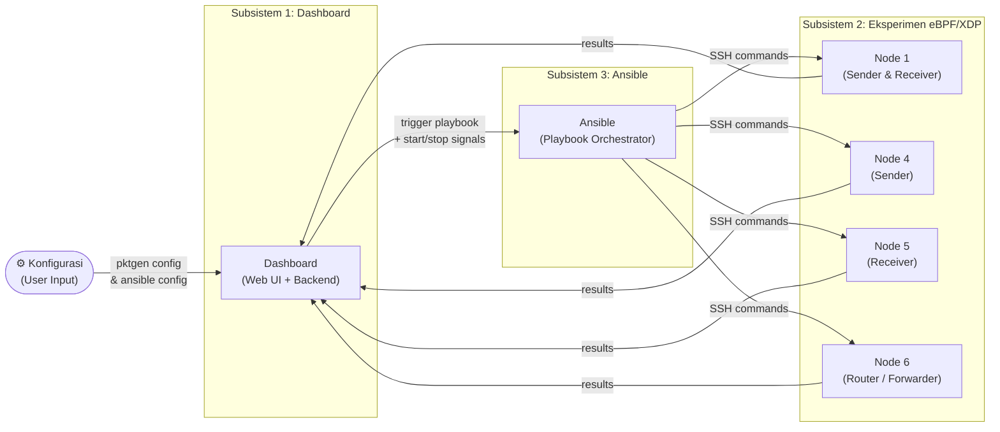
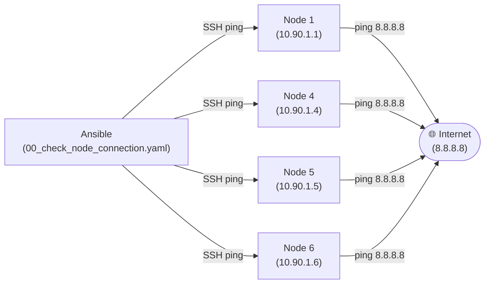
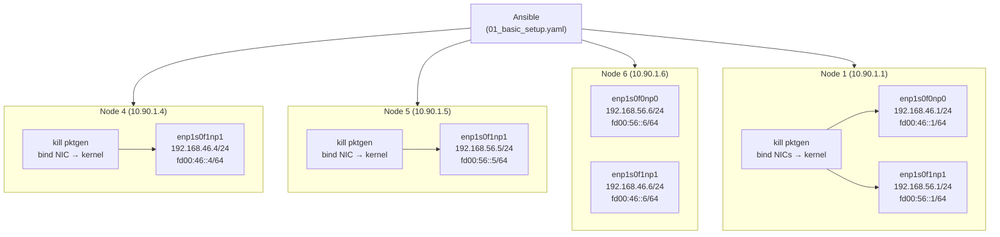
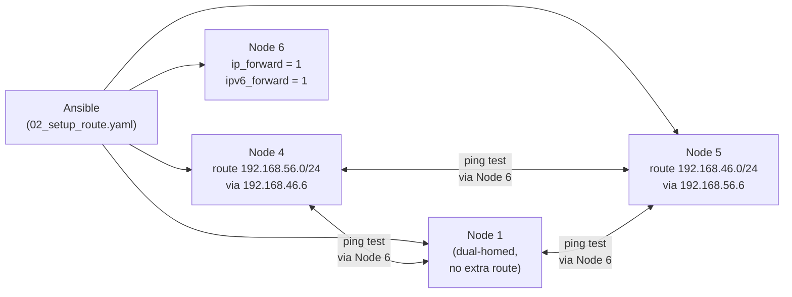
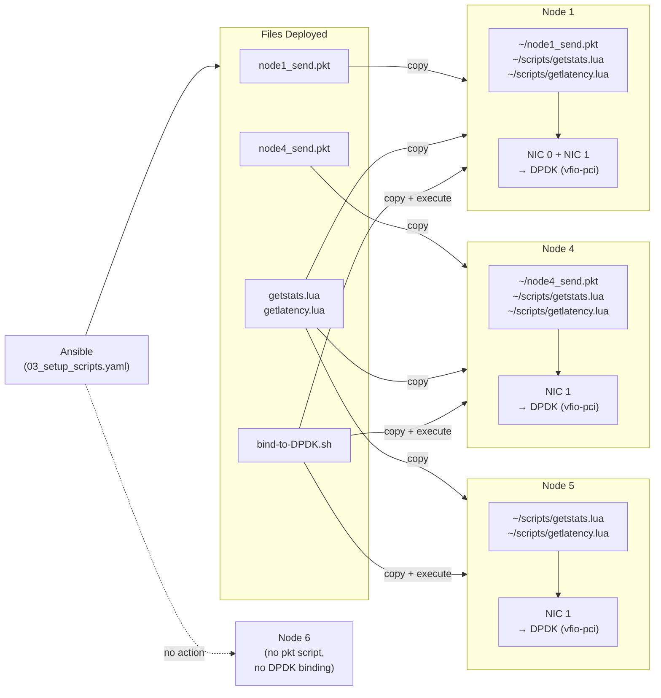
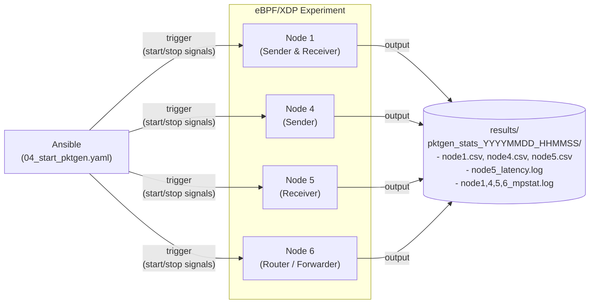
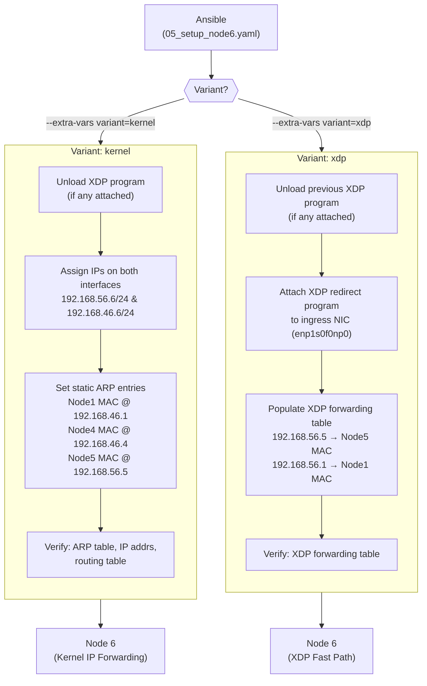

# Ansible Playbook Diagrams

## Section 1 — System Overview

High-level view of the three subsystems and how they interact.

---

## Section 2 — Script 00: Check Node Connectivity

Ansible verifies SSH reachability to all nodes, then checks external internet connectivity.

---

## Section 3 — Script 01: Basic Setup

Ansible kills any running pktgen processes, rebinds NICs to kernel driver, and assigns IP addresses to each node's interfaces.

---

## Section 4 — Script 02: Setup Route & Testing

Ansible configures static routes on sender/receiver nodes, enables IP forwarding on the router (Node 6), and validates end-to-end connectivity with ping tests.

---

## Section 5 — Script 03: Setup Scripts & DPDK Binding

Ansible deploys pktgen packet scripts and Lua stat/latency collection scripts to each node, then rebinds NICs from kernel to DPDK driver.

---

## Section 6 — Script 04: Start Pktgen & Collect Results

The most complex playbook. Ansible and the Dashboard communicate via signal files to control traffic generation and collect experiment results.

---

## Section 7 — Script 05: Node 6 Forwarding Setup

Two mutually exclusive variants for configuring how Node 6 forwards packets between the two network segments.

